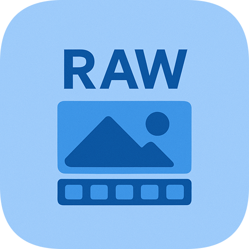

# RAWviewer v3.0

<p align="center">
  
</p>

<p align="center">
  
  
  
  <a href="https://www.buymeacoffee.com/markyip">
    
  </a>
</p>

**語言：** [English](README.md) · **繁體中文**

**RAWviewer** 是一款適用於 **Windows 與 macOS** 的快速相片檢視器。瀏覽 RAW 與 JPEG 資料夾、檢查銳利度、篩選淘汰、搜尋圖庫，並可選擇以 **XMP** 非破壞顯影——**全部在本機完成，無需上傳雲端。**

下載：**[GitHub Releases](https://github.com/markyip/RAWviewer/releases/latest)**

> 完整變更說明：[`RELEASE_NOTES.md`](RELEASE_NOTES.md)
---

## 使用 RAWviewer

開啟資料夾（選單、拖放，或雙擊相片）。在**圖庫**中捲動；點擊縮圖進入全螢幕檢視。

在**大型資料夾**（數千張相片）中，待 EXIF 拍攝時間排序完成後才會顯示 **Gallery** 按鈕，進入圖庫時縮圖即為拍攝順序。若中繼資料已快取，排序可瞬間完成。

在**圖庫檢視**中，拖曳底部列的**大小滑桿**可調整縮圖尺寸。列會以齊行網格（滿寬）重新排版；拖曳時捲動位置會錨定在左上角可見相片。

| 按鍵 | 動作 |
|-----|--------|
| **空白鍵** / **雙擊** | 切換「符合視窗」/ 100% 縮放 |
| **捏合** / **Ctrl+捲動** | 放大 / 縮小 |
| **←** / **→** | 上一張 / 下一張 |
| **滑鼠滾輪** | 上一張 / 下一張（單張檢視、符合模式） |
| **↑** | 加入 / 取消書籤（單張檢視底部**星號**亦可） |
| **↓** | 移至 Discard 資料夾 |
| **Delete** | 刪除影像 |
| **Esc** | 圖庫：清除選取 → 離開書籤篩選 · 單張：返回圖庫 |
| **Ctrl/Cmd+點擊** | 圖庫：切換選取 |
| **Shift+點擊** | 圖庫：範圍選取（可見順序） |
| **C** | 切換比較模式（需選取多張） |
| **E** | 顯示 / 隱藏 **Adjust** 面板（XMP 顯影；實驗性） |
| **0–5** | 星級評分（**0** 清除） |
| **G** | 切換構圖輔助線 |
| **H** | 顯示 / 隱藏直方圖 |
| **J** | 切換高光 / 陰影裁切疊圖 |
| **P** | 切換 RAW 復原預覽——半解析度陰影 / 高光復原（RAW/DNG，僅本工作階段；僅符合模式） |
| **F** | 顯示 / 隱藏對焦疊圖（支援的檔案） |
| **M** | 顯示 / 隱藏 GPS 地圖疊圖（單張檢視、含 GPS 相片；啟動時預設隱藏） |

**比較模式快捷鍵：**
* **← / →** — 上一張 / 下一張候選
* **↑** — 將候選（右側）提升為已選（左側）
* **↓** — 拒絕候選並移至 Discard（Shift+↓ 拒絕選取範圍）
* **Delete** — 將候選刪至資源回收筒 / 垃圾桶（Shift+Delete 刪除選取範圍）
* **空白鍵** — 同步切換兩側縮放（開啟 **F** 對焦框後：左右各自縮放至該張對焦點）
* **F** — 顯示 / 隱藏兩側對焦疊圖（比較模式）
* **J** — 兩側曝光裁切疊圖
* **G** — 兩側構圖格線
* **C** / **Esc** — 離開比較模式

**Adjust（編輯）快捷鍵** — Adjust 面板開啟時（**E**）：

| 按鍵 | 動作 |
|-----|--------|
| **E** / **Esc** | 關閉 Adjust（返回瀏覽 RAW/JPEG 模式） |
| **D** / **B** / **X** / **H** |啟用 **Dodge**／**Burn**／**Eraser**／**Heal**（再按一次取消） |
| **O** | 切換 **Mask** 疊圖（有筆刷工具啟用時） |
| **雙指捲動** | 筆刷啟用時調整 **Brush Size**（**Ctrl+捲動**仍為縮放） |
| **←** / **→** | 微調目前焦點滑桿（無焦點時則上一張／下一張） |
| **Ctrl/Cmd+Z** | 復原上一步編輯 |
| **空白鍵**／**雙擊** | 符合視窗／100% 縮放 |
| **J**／**G**／**F** | 裁切疊圖／構圖輔助線／對焦疊圖（與瀏覽相同） |

說明：**Effect Strength** 僅套用於 Dodge/Burn；Heal 使用 **Size**／**Flow**，inpaint 一律滿強度。瀏覽專用鍵（**M**、**P**、直方圖 **H**）在 Adjust 開啟時不適用——此時 **H** 改為啟用 Heal。

**圖庫書籤：** 點擊空心**星號**（未選取時）僅顯示已加書籤相片；金色星號 = 篩選開啟。已選相片時，**↑** 或星號可切換書籤。

**搜尋：** 圖庫搜尋圖示——可直接輸入中繼資料（如 `tokyo`、`sony`、`2024`），或使用 `camera:sony`、`iso<800` 等篩選（**完整版**另支援 `sunset on beach` 等自然語句）。**分享：** 底部 **Share / Open**，或將圖庫 / 底片列縮圖拖出。

搜尋語法 → [進階參考](#進階參考)。

---

## Lite 與 Full

兩個版本共用相同的**檢視器、篩選、書籤、星級、比較模式、GPS 地圖、中繼資料搜尋，以及 Adjust／Develop 編輯面板**（CPU Fast RAW + XMP）。**Full（完整版）** 另含離線 AI 搜尋、人臉篩選，以及可選的 GPU／ML 工具。**Lite（精簡版）** 安裝較小，適合以瀏覽／篩片為主的機器。

| 功能 | Lite（精簡版） | Full（完整版） |
|---|:--:|:--:|
| 圖庫、底片列、縮放、直方圖、書籤、篩選、比較（**C**） | ✅ | ✅ |
| 星級評分（**0–5**）+ XMP | ✅ | ✅ |
| 中繼資料／地點搜尋（直接輸入或 `camera:`／`iso:`／`city:` 等） | ✅ | ✅ |
| **Adjust** 面板（**E**）— 色調、WB、裁切、D&B、Heal、LUT、暈影／去霧、XMP | ✅ | ✅ |
| 從 Adjust 匯出（JPEG／WebP／TIFF16） | ✅ | ✅ |
| 自然語句 AI 搜尋（如 `sunset on beach`） | — | ✅ |
| 人臉篩選（`has:face`、`no:face`） | — | ✅ |
| MobileCLIP／ONNX／Core ML 模型下載 | — | ✅ |
| 套件內含 PyTorch／kornia | — | ✅ |
| GPU demosaic（`RAWVIEWER_PREFER_GPU_DECODE`） | —（CPU Fast RAW） | ✅（有後端時） |
| AI 降噪匯出路徑 | — | ✅（Full） |
| 典型安裝大小 | 約 500 MB | 約 1.5 GB+（含模型） |
| 建議 RAM | 8 GB+ | 大型圖庫 + AI 索引建議 16 GB+ |

選 **Lite** 可獲較小安裝包，以目視瀏覽／篩片為主（Adjust 仍可用）。選 **Full** 可用日常用語搜尋與人臉篩選——模型安裝後仍為 **100% 離線**。

Windows 安裝精靈可選 **Full (CUDA)**、**Full (DirectML)** 或 **Lite**。macOS 為 **Full**／**Lite** 分開的 zip。

---

## GPS 地圖疊圖與地理標記

在**單張檢視**按 **M** 可切換互動式地圖卡片。卡片會立即開啟並顯示 **Loading map…**，待圖磚載入（無 GPS 的相片不會彈出）。地圖上的**座標徽章**顯示經緯度；點擊可在瀏覽器開啟 **Google Maps**。

內建離線資料庫（`cities500.csv.gz`、`landmarks.csv.gz`，逾 10 萬筆地點）在**背景索引**時將 GPS 解析為城市、地區、國家，供**圖庫搜尋**使用——直接輸入城市名如 `tokyo`、`Taipei`，或使用 `city:tokyo`／`country:jp` 等篩選皆可，無需網路。

若需要整本相簿的**叢集地圖**或為**缺少 GPS 的相片標記位置**，請參閱 **[LocateIt](https://github.com/markyip/LocateIt)**：開啟資料夾、在地圖上檢視拍攝位置、拖放指定座標，並寫回 JPEG 或 RAW。

---

## 下載與安裝

### Windows

1. 從 [Releases](https://github.com/markyip/RAWviewer/releases/latest) 下載 **`RAWviewer_Setup.exe`**。
2. 在安裝精靈選擇 **Full (CUDA)**、**Full (DirectML)** 或 **Lite**。**Full** 會另下載 AI 模型（約 600 MB）。
3. 啟動 **`RAWviewer.exe`** 或桌面捷徑（勿再次執行 Setup）。

> **v3.0 新功能：** **Adjust／Develop**（色調、WB 預設、裁切、Dodge/Burn + Heal、暈影／去霧、Creative LUT／XMP 預設）；**快速 RAW 解碼**；**1–5 星評分**；Nikon **HE/HE*** 瀏覽；**Lite 不含 torch**；圖庫載入大改；macOS 包 OpenMP LibRaw。完整說明見 [`RELEASE_NOTES.md`](RELEASE_NOTES.md)。

會註冊常見格式的**開啟方式**。解除安裝：設定 → 應用程式，或 `%LOCALAPPDATA%\RAWviewer` 內的 **`uninstall.bat`**。

### macOS（13+）

1. 從 **[Releases](https://github.com/markyip/RAWviewer/releases/latest)** 下載 **`RAWviewer-v3.0-macOS.zip`**（Full）或 **`RAWviewer-v3.0-macOS-Lite.zip`**（Lite）並解壓。
2. 開啟**終端機**，進入解壓資料夾（`cd ` 後將資料夾拖入終端機），執行：

```bash
bash install_macos_app.sh
```

3. 在對話框點擊 **Install**，再點 **Open**。RAWviewer 會複製到**應用程式**資料夾。

**完整版：** 首次使用圖庫**搜尋**時，可能提示從 [Hugging Face](https://huggingface.co/) 下載離線 AI 模型（macOS 約 150 MB，一次性，需網路）。無 Hugging Face 帳號時可能較慢。出現提示時點 **Download**——進度顯示於搜尋列 `Downloading... N%`。Windows 安裝程式會自動下載相同模型。

解除安裝：**`uninstall_macos_app.sh`** 或壓縮檔內的 **`Uninstall RAWviewer.command`**（會清除快取；僅丟到垃圾桶不會）。

### 系統需求

Windows 10+ · macOS 13+ · 8 GB RAM（**Full** + 大型資料夾建議 16 GB+）· 約 500 MB 磁碟（**Lite**）或 1.5 GB+（**Full** 含模型）

僅清除縮圖快取：**`scripts\Launch\bat\clear_cache.bat`**（Windows）· **`scripts/Launch/shell/clear_cache.sh`**（Mac）

---

## 支援格式

**RAW：** CR2、CR3、NEF、ARW、DNG、ORF、RW2、RAF 及其他 LibRaw 類型 · **標準：** JPEG、TIFF、HEIF、**GIF**（動畫）、**WebP**（動畫）

在 **macOS** 與 **Windows** 上，HDR **HEIC / HEIF / AVIF** 與 HDR **TIFF** 會 tone-map 至 SDR 以維持瀏覽速度。**v3.0 已移除 macOS EDR**，以確保 Fast RAW 載入維持高速（見 [`RELEASE_NOTES.md`](RELEASE_NOTES.md)）。

**Nikon HE / HE\* NEF：** 目前 LibRaw 無法 demosaic High Efficiency 壓縮。RAWviewer 仍可透過**內嵌 JPEG**開啟（瀏覽／篩片正常，不會誤報「不支援或損毀」）。在解碼器就緒前，**Adjust／RAW 顯影對 HE/HE\* 停用**——與 JPEG/HEIC 相同，僅能瀏覽。無損／標準 NEF 則可正常 demosaic 與編輯。

---

## 單張檢視工具

**工作流程切換：** 在 **內嵌 JPEG（快速）** 與 **RAW（高品質）** 間切換。

**復原預覽（P）：** 半解析度陰影／高光復原，用於判斷極端對比——僅本工作階段，不取代全解析度檢視。

**Adjust（E）：** 非破壞顯影寫入 XMP。預設**瀏覽介面顯示原始像素**；編輯結果在 Adjust 面板內呈現（`RAWVIEWER_SIDECAR_ADJUST=1` 可讓瀏覽套用已存編輯）。編輯功能為實驗性——不保證涵蓋所有新型相機。快捷鍵見上方 **Adjust（編輯）快捷鍵**。

---

## 疑難排解

### 所有平台

| 問題 | 處理方式 |
|------|----------|
| GPS 地圖不顯示 | 單張檢視按 **M**；僅含 GPS 的相片會顯示地圖 |
| HDR HEIC/TIFF 偏平或偏暗 | v3.0 設計上會將 HDR 靜態 tone-map 至 SDR（為 Fast RAW 已移除 macOS EDR） |
| **P** / **J** 無效 | **P**/**J** 僅 RAW/DNG 單張；**P** 僅符合模式半解析度預覽。**P** 復原另需 scipy + rawpy——失敗時查日誌 |

### Windows

| 問題 | 處理方式 |
|------|----------|
| SmartScreen 警告 | 詳細資訊 → 仍要執行 |
| AI 搜尋慢（**Full**） | 多數 PC 建議 **DirectML**；僅 NVIDIA + CUDA 時用 **CUDA** |
| 安裝卡在「Downloading models」（**Full**） | AI 模型約 600 MB，可能需數分鐘。失敗時檢查防火牆、VPN 或 Proxy——瀏覽仍可用；稍後開圖庫 **Search** 重試 |
| 又開啟 Setup 而非程式 | 啟動 **`RAWviewer.exe`** 或桌面捷徑——不是 **`RAWviewer_Setup.exe`** |
| 安裝後無 AI 搜尋（**Full**） | 開圖庫 **Search** → 接受下載提示 |
| 開啟方式沒有 RAWviewer | 重新執行安裝（修復）或重裝 |
| 解除安裝後殘留快取 | 再執行 **`uninstall.bat`**，或手動刪除 `%USERPROFILE%\.rawviewer_cache` |
| AI 索引時記憶體不足 | 見[開發者](#開發者)的[自動記憶體調校](#自動記憶體調校)；8 GB 請用 **Lite** 或設 `RAWVIEWER_MEMORY_TIER_AUTO=0` 並手動降低 worker |
| 重開上次資料夾後變慢或退出 | 8 GB 機器請用 **Lite** 或設 `RAWVIEWER_DISABLE_SESSION_RESTORE=1` |
| RAW 總是顯示 demosaic 而非內嵌 JPEG | 切換至 **內嵌 JPEG 工作流程** |
| 當機 | 設 `RAWVIEWER_FILE_LOG=1` 啟用檔案日誌，再查安裝目錄 |

### macOS

| 問題 | 處理方式 |
|------|----------|
| 系統阻擋（「損毀」/ 無法開啟） | 在解壓資料夾執行 `bash install_macos_app.sh`（見上方安裝步驟） |
| `bash: command not found` | 輸入 `cd `，將解壓資料夾拖入終端機，按 Return，再執行指令 |
| 無法讀取桌面 / 文件 | 系統設定 → 隱私權 → **完整磁碟存取** → 加入 RAWviewer |
| 搜尋提示缺少模型（**Full**） | 開圖庫搜尋，出現提示時點 **Download**（需網路一次） |
| 下載失敗（SSL / 憑證） | 企業 VPN / Proxy 請將根憑證加入**鑰匙圈**並設為**永遠信任** |
| 需完整解除安裝 | 使用壓縮檔內 **`uninstall_macos_app.sh`** 或 **`Uninstall RAWviewer.command`**——勿只丟垃圾桶 |
| 找不到解除安裝腳本 | 從 [Releases](https://github.com/markyip/RAWviewer/releases/latest) 重新下載；腳本在解壓資料夾內 |
| 索引時記憶體不足 / 大量 swap | 見[開發者](#開發者)的[自動記憶體調校](#自動記憶體調校)。8 GB Mac 建議 **Lite** 或待索引完成再開大型圖庫 |
| 重開被終止（`Killed: 9` / exit 137） | 可試 **Lite**、`RAWVIEWER_DISABLE_SESSION_RESTORE=1` 或 `RAWVIEWER_ENABLE_SEMANTIC_SEARCH=0` |
| 大型資料夾圖庫仍卡頓 | 執行 **`clear_cache.sh`** 後重開資料夾 |
| 大型資料夾首次開 Gallery 較慢 | 正常——等待 EXIF 拍攝時間排序以確保順序；中繼資料已快取時可瞬間完成 |

更多細節：[`scripts/Launch/README.md`](scripts/Launch/README.md)

---

## 進階參考

*選讀——供進階搜尋與疑難排解。*

> **縮圖快取說明：** 為加快圖庫載入，RAWviewer 會在本機建立縮圖快取。**絕不會上傳或分享**——僅存於你的電腦。快取檔在 **30 天**未使用後自動刪除。

### 圖庫搜尋語法

以空格分隔關鍵字。**多數中繼資料不必加前綴**——若關鍵字出現在已索引欄位（地點、相機、鏡頭、檔名，或類似 `2024`／`2024-05` 的日期），直接輸入即可篩選。需要指定欄位、比較條件，或與其他條件組合時，再用 `key:value`。

| 類型 | 範例 |
|------|------|
| 地點 | `tokyo` · `Taipei` · `hong kong` · `city:tokyo` · `country:jp` |
| 相機 / 鏡頭 | `sony` · `canon` · `70-200` · `camera:canon` · `lens:70-200` |
| 檔名 | `_dsc` · `IMG_1234` · `filename:_dsc` |
| 日期 | `2024` · `2024-05` · `date:2024-05` |
| ISO / 年份（比較） | `iso<=800` · `iso under 800` · `year>=2024` |
| 格式 | `format:raw` · `format:jpeg` · `format:cr3` |
| GPS / 人臉 | `has:gps` · `has:face` · `no:face` *（人臉篩選：僅 Full）* |
| 自由文字 + 篩選 | `jet takeoff camera:sony iso<800` *（Full：未匹配的自由文字走 AI）* |

**人臉與語意搜尋：** `face`、`people`、`person` 等使用已儲存人臉計數（`has:face`），非神經網路語意搜尋。

**索引：** **Full** 版在大型資料夾背景執行語意搜尋與人臉計數（先中繼資料 + AI，再人臉）。**搜尋欄在索引完成前為唯讀**（**Lite：** 中繼資料；**Full：** 中繼資料、嵌入向量，以及啟用時的人臉掃描）。**切換資料夾**時會取消上一資料夾的索引與預載（**v2.5.0**）。

### MobileCLIP 模型（Full——AI 搜尋）

| 平台 | 下載時機 | 變更型號（Windows） |
|------|----------|---------------------|
| **Windows Full** | 安裝時（約 600 MB） | 設 `RAWVIEWER_MOBILECLIP_VARIANT` 為 `s0`、`s2`、`b` 或 `l14` |
| **macOS Full** | 首次圖庫搜尋（約 150 MB） | 開發：`python scripts/download_mobileclip_coreml.py --out-dir models/mobileclip2_coreml` |

**Lite** 不使用 MobileCLIP 模型。

### 對焦疊圖（`F`）依品牌

| 品牌 | 支援 |
|------|------|
| Canon CR2/CR3、Nikon NEF、Sony ARW、Olympus ORF、Panasonic RW2 | 是（製造商 AF） |
| JPEG / TIFF / HEIF | 有時（EXIF SubjectArea） |
| Fujifilm RAF、Hasselblad 3FR、Pentax PEF、Samsung SRW、Sigma X3F | 否 |
| 常見 Adobe DNG | 通常否 |

RAW 製造商 AF 需 **pyexiv2**。

### macOS 版本支援

| 你的 Mac | 官方 `.zip` | 從原始碼建置 |
|----------|-------------|--------------|
| macOS 13 Ventura（Intel） | ✅ | `build_macos_full.sh` 或 Pixi |
| macOS 13 Ventura（Apple Silicon） | ✅ | 請用 **`build_macos_full.sh`**（Pixi 需 14+） |
| macOS 14 Sonoma+ | ✅ | Pixi 或 `build_macos.sh` |
| macOS 12 Monterey 或更舊 | ❌ | ❌ |

### 即將／剩餘工作

細節與可行性排序見 [`RELEASE_NOTES.md`](RELEASE_NOTES.md)（v3.0 Known Issues & Remaining Work）。

**Windows HDR／安全恢復 Mac EDR**——v2.5 曾提供 macOS EDR；**3.0 為維持 Fast RAW 已移除**。未來若恢復／新增 HDR 顯示，需避免拖慢瀏覽。

**剩餘工作（可行性高→低）：**
1. **冷資料夾已編輯縮圖重生** — Adjust 儲存時已烘焙與編輯器對齊的縮圖；從未開過 Adjust 的編輯可選 `SIDECAR_ADJUST`。
2. **更廣的局部遮罩** — 漸層／Clone（Dodge/Burn + Heal＋裁切已交付）。
3. **DNG 匯出** — 需真正 writer。
4. **ML 主體遮罩** — 僅 Full。
5. **Windows HDR／安全恢復 Mac EDR**。
6. **VLM 輔助調整** — 產品／模型範圍大。
7. **HE-NEF RAW 編輯** — 尚無 demosaic 解碼器（目前僅瀏覽內嵌 JPEG）。

**已於 3.0 交付：** 快速 RAW、Adjust（HSL、Creative LUT、WB 預設、裁切、D&B＋Heal、暈影／去霧、XMP 預設）、macOS 正式包 OpenMP LibRaw、星級、連拍／比較（**C**）、Lite 不含 torch、圖庫載入大改。GPU **視埠**預設開啟（`RAWVIEWER_GPU_VIEW=0` 關閉）。

---

## 開發者

腳本與建置矩陣：[`scripts/Launch/README.md`](scripts/Launch/README.md)

### 自動記憶體調校

每次啟動時，RAWviewer 讀取**已安裝的系統 RAM**（非當下可用記憶體），並套用載入並行度、預覽快取、預載與索引的保守預設——**僅在你尚未自行設定相同環境變數時**。

| 層級 | 已安裝 RAM | 典型 Mac | 摘要 |
|------|------------|----------|------|
| **low** | &lt; 10 GB | 8 GB MacBook Air | 索引時關閉人臉掃描；較少平行 worker；較小預覽快取；較少閒置預載 |
| **medium** | 10–14 GB | 12 GB 統一記憶體 | 適度限制 worker 與快取 |
| **balanced** | 14–20 GB | 16 GB | 輕度調校（多數筆電預設） |
| **high** | 20–28 GB | 24 GB | 略提高快取 / worker 上限 |
| **ultra** | ≥ 28 GB | 32 GB+ 工作站 | 應用程式預設（不覆寫） |

**你可能會看到**

- 啟動日誌（開發 / 終端機）：`[PROFILE] memory tier=balanced (16.0 GB RAM)`
- 備註檔：`~/.rawviewer_cache/memory_tier.json`（層級、RAM、套用了多少預設）
- **Lite** 仍先套用 Lite 設定檔；RAM 層級僅填補未設定的項目
- 8 GB Mac 上的 **Full**：語意 AI 仍可運行，但會自動關閉人臉索引以減輕記憶體壓力
- **重新啟動（v2.4.1+）：** 工作階段還原會錯開全解析度解碼與預載，降低 OOM；若符合視圖數秒內仍偏軟屬正常

**關閉自動調校**（僅使用自己的環境變數或腳本）：

```bash
export RAWVIEWER_MEMORY_TIER_AUTO=0
```

**強制覆寫**（優先於自動調校——低記憶體範例）：

```bash
export RAWVIEWER_ENABLE_FACE_SCAN=0
export RAWVIEWER_SEMANTIC_PREP_WORKERS=2
export RAWVIEWER_MEMORY_PREVIEW_MAX=1280
export RAWVIEWER_IDLE_DISPLAY_PREFETCH=0
```

AI 索引的語意 batch / chunk 大小會在**首次索引**時**另行自動調校**（macOS Core ML、Windows ONNX）；結果快取於 `~/.rawviewer_cache/semantic_batch_tuning.json`。

### 環境變數

<details>
<summary><strong>展開——開發 / 調校旗標</strong></summary>

| 變數 | 效果 |
|------|------|
| `RAWVIEWER_MEMORY_TIER_AUTO=1` | **預設。** 依已安裝 RAM 調校 worker、快取、預載 |
| `RAWVIEWER_MEMORY_TIER_AUTO=0` | 關閉 RAM 層級預設；僅套用明確設定的環境變數 |
| `RAWVIEWER_MOBILECLIP_VARIANT` | Windows ONNX 模型：`b`（預設）、`s0`、`s2`、`l14` |
| `RAWVIEWER_GPU_VIEW=1` | GPU 單張視埠（OpenGL 縮放 / 平移；正式版預設開啟） |
| `RAWVIEWER_GPU_VIEW=0` | 強制傳統捲動區單張視圖 |
| `RAWVIEWER_FAST_RAW_DECODE=1` | **預設。** half/full Fast RAW 共用 unpack；`0` 較接近 rawpy |
| `RAWVIEWER_SIDECAR_ADJUST=0` | **預設。** 瀏覽顯示原始像素；編輯在 Adjust 呈現。設 `1` 讓瀏覽套用已存 XMP |
| `RAWVIEWER_LIBRAW_CONSISTENT_PREVIEW=1` | RAW 符合與 100% 縮放同色票流程（預設開啟） |
| `RAWVIEWER_EXIF_BACKEND=auto` | `auto`、`pyexiv2` 或 `exifread` |
| `RAWVIEWER_SHARE_MENU=1` | macOS：Qt 分享選單（建議） |
| `RAWVIEWER_SHARE_TRY_NATIVE_PICKER=1` | macOS：優先嘗試原生分享表 |
| `RAWVIEWER_INDEX_DEFER_FACE_SCAN=1` | 語意索引完成後再做人臉掃描（預設） |
| `RAWVIEWER_SEMANTIC_PREP_WORKERS` | AI 編碼前平行 CPU worker（RAM 層級可能設定） |
| `RAWVIEWER_SEMANTIC_BATCH_AUTO=1` | 索引時自動調校 AI batch/chunk（預設） |
| `RAWVIEWER_SEMANTIC_BATCH_CANDIDATES` | 自動調校候選 batch（預設 `8,16,32,64,128`） |
| `RAWVIEWER_PREVIEW_CACHE_ITEMS` | 記憶體中預覽 LRU 上限 |
| `RAWVIEWER_MEMORY_PREVIEW_MAX` | 記憶體中 RAW/JPEG 預覽長邊上限（像素） |
| `RAWVIEWER_IDLE_DISPLAY_PREFETCH=0` | 關閉單張檢視閒置鄰張預載 |
| `RAWVIEWER_SESSION_RESTORE_DEFER_PRELOAD=1` | **預設。** 重新啟動後延遲全解析度解碼與鄰張預載（見 v2.4.1 發行說明） |
| `RAWVIEWER_SESSION_RESTORE_FULL_DECODE_DELAY_MS` | 首次繪製後至全解析度解碼的延遲毫秒（預設 `2500`） |
| `RAWVIEWER_DISABLE_SESSION_RESTORE=1` | 啟動時不還原上次資料夾 / 檔案 |

完整清單與開發預設：[`scripts/Launch/README.md`](scripts/Launch/README.md)、[`docs/macos-sharing-v21-v22.md`](docs/macos-sharing-v21-v22.md)。

</details>

### 快速開始

```bash
pixi install
pixi run start          # full profile（預設）
```

**Windows**

| 任務 | 腳本 |
|------|------|
| 執行（full） | `scripts\Launch\bat\launch_dev_full.bat` |
| 執行（lite） | `scripts\Launch\bat\launch_dev_lite.bat` |
| 建置 Full 安裝程式 | `scripts\Launch\bat\build_windows_full.bat`（CUDA）或 `build_windows_full.bat directml` |
| 建置 Lite 安裝程式 | `scripts\Launch\bat\build_windows_lite.bat` |
| 建置兩種 Full 後端 | `scripts\Launch\bat\build_windows_all.bat` |

**macOS**

| 任務 | 腳本 |
|------|------|
| 執行（full） | `./scripts/Launch/shell/launch_dev_full.sh` |
| 執行（lite） | `./scripts/Launch/shell/launch_dev_lite.sh` |
| 建置 Full | `./scripts/Launch/shell/build_macos_full.sh` → `dist/RAWviewer.app` |
| 建置 Lite | `./scripts/Launch/shell/build_macos_lite.sh` → `dist/RAWviewer_Lite.app` |

建置產物：

| 設定檔 | Windows | macOS |
|--------|---------|-------|
| **Full / Unified** | `dist/RAWviewer_Setup.exe`（含 Full 與 Lite 選項） | `dist/RAWviewer-v3.0-macOS.zip` |
| **Lite** | （在 `RAWviewer_Setup.exe` 選 Lite） | `dist/RAWviewer-v3.0-macOS-Lite.zip` |

相依套件見 `pixi.toml`。封裝腳本建置正式版時使用本機 `rawviewer_env/` 虛擬環境。

<details>
<summary><strong>從原始碼建置（指令）</strong></summary>

**Windows**
```batch
scripts\Launch\bat\build_windows_full.bat
scripts\Launch\bat\build_windows_lite.bat
```

**macOS**
```bash
./scripts/Launch/shell/build_macos_full.sh
./scripts/Launch/shell/build_macos_lite.sh
# 或：pixi install && pixi run python build.py --profile full
```

</details>

### 架構（簡述）

- **ImageLoadManager** — 執行緒載入佇列；切換資料夾會取消進行中任務（**v2.5.0**）
- **UnifiedImageProcessor** — RAW/JPEG/TIFF 統一路徑；**Fast RAW decode** half/full 共用 unpack（**v3.0.0**）
- **星級評分** — 1–5 + XMP；圖庫最低星級篩選（**v3.0.0**）
- **Adjust／Develop** — 色調、WB、裁切、Dodge/Burn、Heal（`cv2.inpaint`）、暈影／去霧、LUT／XMP 預設；預設在 Adjust 內呈現編輯（**v3.0.0**）
- **Cache** — 記憶體優先；可選磁碟快取；啟動時 **RAM 層級預設**（`rawviewer_profile.py`）
- **Semantic index** — SQLite + 本機嵌入（macOS Core ML、Windows ONNX；**僅 Full**）；切換資料夾範圍時中止背景 pass（**v2.5.0**）
- **Gallery（JustifiedGallery）** — 齊行網格與縮放滑桿；EXIF 排序後拍攝時間順序（**v2.5.0**＋**v3.0.0** 圖庫填入大改）
- **RAW 復原預覽** — **P** 鍵，半解析度線性解碼 + 區域 tone 復原（**v2.5.0**）
- **裁切疊圖** — **J** 鍵（`exposure_clipping.py`；**v2.5.0**）
- **Lite 設定檔** — 不含 torch／kornia；語意／人臉關閉；CPU Fast RAW + Adjust（**v3.0.0**）

---

## 授權

MIT——見 [LICENSE](LICENSE)。

## 貢獻

歡迎在 [GitHub](https://github.com/markyip/RAWviewer) 提交 Pull Request。

## 支援

1. 先查上方[疑難排解](#疑難排解)  
2. 搜尋[既有議題](https://github.com/markyip/RAWviewer/issues)  
3. 若仍無解，請開新議題並附上作業系統版本、步驟與日誌  

## ☕ Buy Me a Coffee

若 RAWviewer 對你的工作流程有幫助，歡迎 [請我喝杯咖啡](https://www.buymeacoffee.com/markyip) ☕

---

**享受你的相片。** 📸
