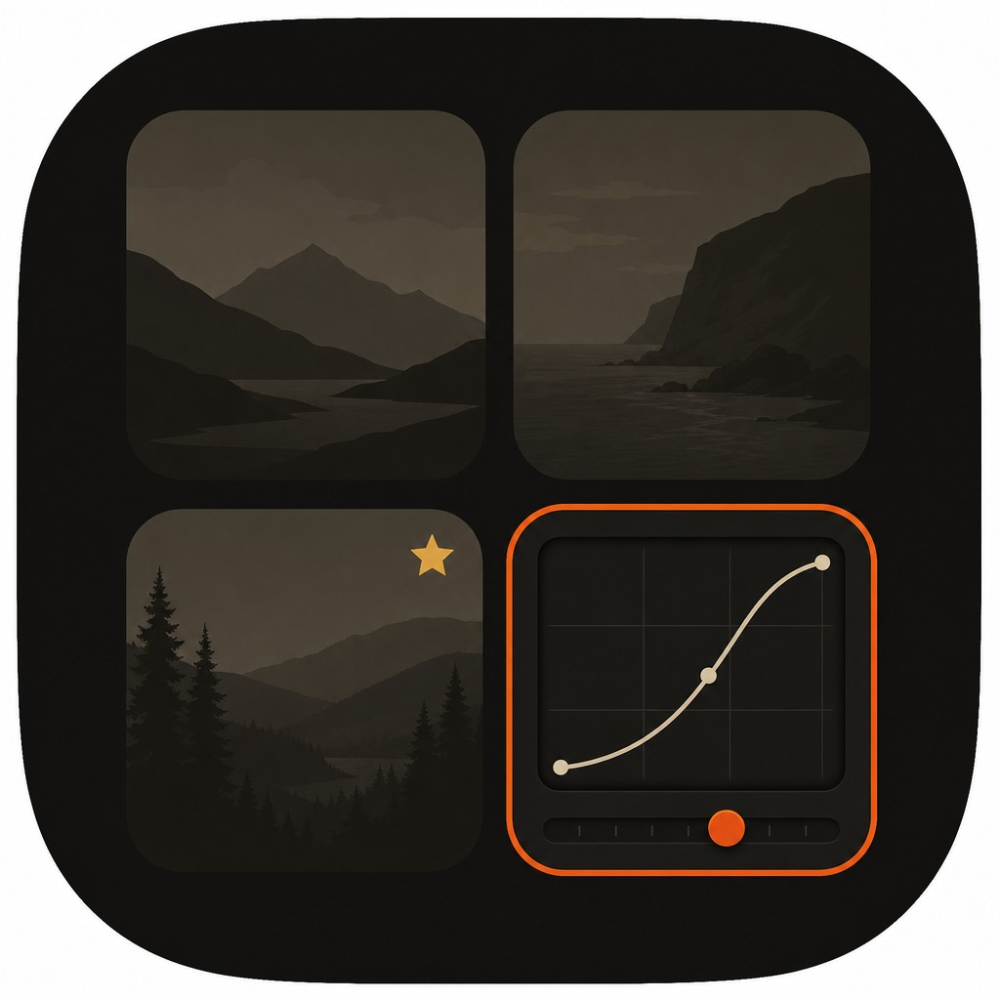
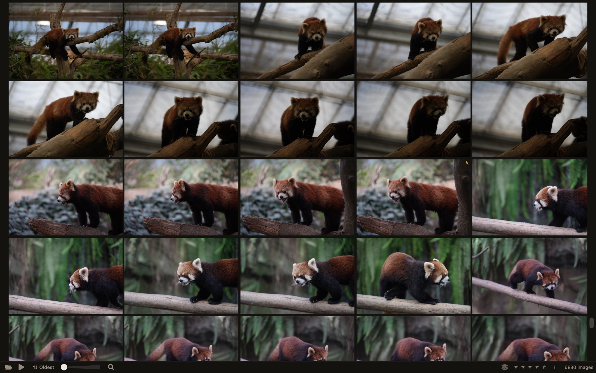
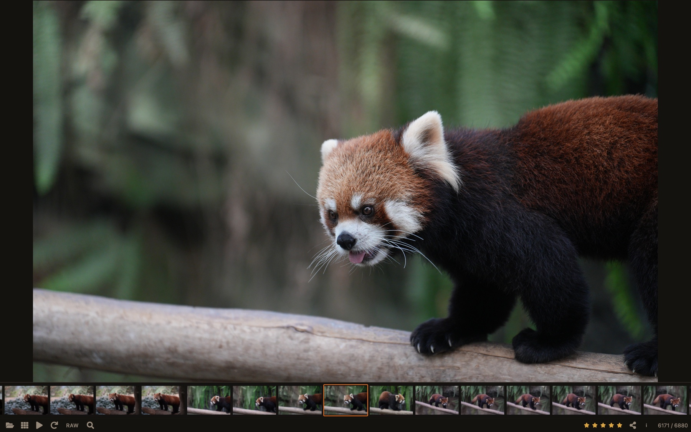
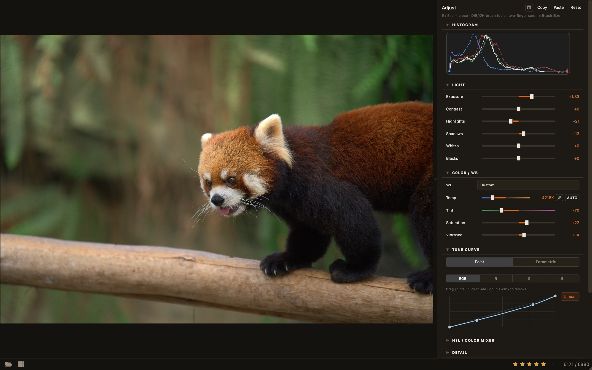

<p align="center">
  
</p>

<h1 align="center">RAWviewer</h1>

<p align="center"><strong>瀏覽、篩選、評分數千張 RAW 相片——快速、私密、完全在你的電腦上完成。</strong></p>

<p align="center">
  
</p>

<p align="center">
  <a href="https://github.com/markyip/RAWviewer/releases/latest"><strong>⬇&nbsp; 下載 Windows 版</strong></a>
  &nbsp;·&nbsp;
  <a href="https://github.com/markyip/RAWviewer/releases/latest"><strong>⬇&nbsp; 下載 macOS 版</strong></a>
</p>

<p align="center">免費 · 開放原始碼（MIT）· 離線運作——相片絕不離開你的電腦</p>

<p align="center">
  
  
  
  <a href="https://www.buymeacoffee.com/markyip">
    
  </a>
</p>

**Language / 語言：** [English](README.md) · [繁體中文](README.zh-TW.md)

---

## 它能做什麼

- **以拍攝的速度瀏覽。** 開啟一個 RAW 資料夾，用方向鍵全螢幕翻閱——不必匯入、沒有目錄庫、無需等待。
- **用手指篩片，不用滑鼠。** **1–5** 給留下的照片打星、**↓** 移至淘汰資料夾、**0** 清除星級、**C** 讓相似的幾張並排比較並同步縮放。
- **找到任何一張相片。** 在圖庫搜尋輸入地點（`tokyo`）、相機（`sony`）或年份（`2024`）。完整版還聽得懂日常描述，例如 `sunset on beach`——全部離線完成。
- **顯影而不動原始檔。** 按 **E** 開啟 Adjust 面板：曝光、白平衡、裁切、Dodge & Burn、修復筆刷、LUT。所有編輯寫入 XMP sidecar，RAW 檔永遠保持原樣。

<p align="center">
  
  <br><em>全螢幕瀏覽：底片列與星級評分</em>
</p>

<p align="center">
  
  <br><em>Adjust 面板（前後對比分割）：非破壞顯影，寫入 XMP</em>
</p>

## 3.0 新功能

- **明顯快過 2.5** — Windows 冷啟動套件（每次清快取）：圖庫就緒約 **2.7–2.9×**（**8.6 秒 → 約 3 秒**）；RAW 全解析度導航中位數約 **1.6–1.7×**（**0.95 秒 → 約 0.6 秒**）。Lite 與 Full 共用 3.0 管線，篩片關鍵路徑皆勝過 2.5 — 見 [`RELEASE_NOTES.zh-TW.md`](RELEASE_NOTES.zh-TW.md)
- **Adjust 面板** — 非破壞顯影：色調、白平衡預設、裁切、Dodge & Burn、修復筆刷、暈影／去霧、Creative LUT 與可儲存的預設；匯出 JPEG／WebP／16 位元 TIFF（**Windows 完整版**另提供僅於匯出時套用的 **AI 降噪**，使用 SCUNet；macOS 的 `.app` 不含此選項——見[選 Lite 還是 Full？](#選-lite-還是-full)）
- **星級評分** — 用數字鍵 1–5 評分；圖庫可依最低星級篩選
- **Nikon 高效率（HE/HE\*）檔案**現可瀏覽與篩片
- **更精簡的 Lite 版**，適合在意安裝大小的機器

完整變更說明：[`RELEASE_NOTES.zh-TW.md`](RELEASE_NOTES.zh-TW.md)

---

## 開始使用

### Windows

1. 從 [Releases](https://github.com/markyip/RAWviewer/releases/latest) 下載 **`RAWviewer_Setup.exe`**。
2. 在安裝精靈選擇 **Full 完整版**（含相片描述搜尋，另下載約 600 MB 模型）或 **Lite 精簡版**（較小）。不確定？見下方[選 Lite 還是 Full？](#選-lite-還是-full)。
3. **從舊版升級？** 可選擇勾選安裝精靈中的 **Clear existing cache**。可啟用較快的搜尋／索引預設，**不會**刪除相片或 XMP。
4. 從桌面捷徑啟動 **RAWviewer**。

常見相片格式會自動加入**開啟方式**。隨時可從「設定 → 應用程式」解除安裝。之後若要清快取，可執行安裝目錄內與 `RAWviewer.exe` 同層的 **`clear_cache.bat`**。

### macOS（13 或更新）

1. 從 [Releases](https://github.com/markyip/RAWviewer/releases/latest) 下載 macOS zip（**Full** 或 **Lite**），雙擊解壓。
2. 開啟**終端機**（Spotlight 搜尋「終端機」），輸入 `cd `（含一個空格），把解壓出的資料夾拖進終端機視窗，按 Return。
3. 執行安裝腳本，依序點擊兩個對話框（**Install**、**Open**）：

```bash
bash install_macos_app.sh
```

4. **升級？** 建議清一次快取，讓搜尋／索引使用較新、較快的預設（不會刪除相片或 XMP）：
   - 雙擊 **Clear Cache.command**（若被阻擋：右鍵 → 打開 → 打開），或
   - 在終端機執行：`bash clear_macos_cache.sh`

RAWviewer 會複製到「應用程式」資料夾。這個一次性的終端機步驟是讓 macOS 信任這個 App——之後就和一般 App 一樣直接開啟。要移除時請使用 zip 內的 **`Uninstall RAWviewer.command`**（只丟垃圾桶會殘留快取檔）。完整步驟見壓縮檔內的 **Start Here.txt**。

**完整版：** 首次使用圖庫**搜尋**時，會提示一次性下載 AI 模型（約 150 MB，僅此一次需要網路）。點 **Download** 後，搜尋即完全離線。

### 上手的前十分鐘

開啟任何相片資料夾（拖進視窗，或雙擊一張相片），然後：

| 按鍵 | 動作 |
|-----|--------|
| **← / →** | 上一張 / 下一張 |
| **空白鍵** 或雙擊 | 符合視窗 ↔ 100% 縮放 |
| **0–5** | 星級評分（0 清除；底部星星亦可） |
| **↓** | 移至淘汰（Discard）資料夾 |
| **C** | 並排比較選取的相片 |
| **E** | 開啟 Adjust（顯影）面板 |
| **Esc** | 返回圖庫 |

篩片流程就是這樣。以下內容都是選讀。

<details>
<summary><strong>所有瀏覽與圖庫快捷鍵</strong></summary>

開啟資料夾（選單、拖放，或雙擊相片）。在**圖庫**中捲動；點擊縮圖進入全螢幕檢視。**大型資料夾**（數千張）會待拍攝時間排序完成後才顯示 **Gallery** 按鈕，確保縮圖為拍攝順序；中繼資料已快取時排序瞬間完成。圖庫底部的**大小滑桿**可調整縮圖尺寸。

| 按鍵 | 動作 |
|-----|--------|
| **空白鍵** / **雙擊** | 切換「符合視窗」/ 100% 縮放 |
| **捏合** / **Ctrl+捲動** | 放大 / 縮小 |
| **←** / **→** | 上一張 / 下一張 |
| **滑鼠滾輪** | 上一張 / 下一張（單張檢視、符合模式） |
| **0–5** | 星級評分（**0** 清除；單張檢視底部星星亦可） |
| **↓** | 移至 Discard 資料夾 |
| **Delete** | 刪除影像 |
| **Esc** | 圖庫：清除選取 → 離開篩選 · 單張：返回圖庫 |
| **Ctrl/Cmd+點擊** | 圖庫：切換選取 |
| **Shift+點擊** | 圖庫：範圍選取（可見順序） |
| **↑** | 圖庫：向上捲動 · 比較模式：提升候選 |
| **C** | 切換比較模式（需選取多張） |
| **E** | 顯示 / 隱藏 **Adjust** 面板 |
| **G** | 切換構圖輔助線 |
| **H** | 顯示 / 隱藏直方圖 |
| **J** | 切換高光 / 陰影裁切疊圖 |
| **P** | 切換 RAW 復原預覽——半解析度陰影 / 高光復原（RAW/DNG，僅本工作階段；僅符合模式） |
| **F** | 顯示 / 隱藏對焦疊圖（支援的檔案） |
| **M** | 顯示 / 隱藏 GPS 地圖疊圖（單張檢視、含 GPS 相片） |

**圖庫星級篩選：** 用底部**星星**只顯示 ≥ N★ 的相片。

**單張檢視工作流程切換：** 在**內嵌 JPEG（快速）**與 **RAW（高品質）**間切換。**復原預覽（P）**以半解析度顯示陰影／高光復原，用於判斷極端對比。

**分享：** 底部 **Share / Open** 按鈕，或將圖庫 / 底片列縮圖拖出。

</details>

<details>
<summary><strong>比較模式快捷鍵</strong></summary>

* **← / →** — 上一張 / 下一張候選
* **↑** — 將候選（右側）提升為已選（左側）
* **↓** — 拒絕候選並移至 Discard（Shift+↓ 拒絕選取範圍）
* **Delete** — 將候選刪至資源回收筒 / 垃圾桶（Shift+Delete 刪除選取範圍）
* **空白鍵** — 同步切換兩側縮放（開啟 **F** 對焦框後：左右各自縮放至該張對焦點）
* **F** — 顯示 / 隱藏兩側對焦疊圖
* **J** — 兩側曝光裁切疊圖
* **G** — 兩側構圖格線
* **C** / **Esc** — 離開比較模式

</details>

<details>
<summary><strong>Adjust（顯影）快捷鍵</strong></summary>

Adjust 面板開啟時（**E**）：

| 按鍵 | 動作 |
|-----|--------|
| **E** / **Esc** | 關閉 Adjust（返回瀏覽模式） |
| **D** / **B** / **X** / **H** | 啟用 **Dodge**／**Burn**／**Eraser**／**Heal**（再按一次取消） |
| **O** | 切換 **Mask** 疊圖（有筆刷工具啟用時） |
| **雙指捲動** | 筆刷啟用時調整 **Brush Size**（**Ctrl+捲動**仍為縮放） |
| **←** / **→** | 微調目前焦點滑桿（無焦點時則上一張／下一張） |
| **Ctrl/Cmd+Z** | 復原上一步編輯 |
| **空白鍵**／**雙擊** | 符合視窗／100% 縮放 |
| **J**／**G**／**F** | 裁切疊圖／構圖輔助線／對焦疊圖（與瀏覽相同） |

說明：**Effect Strength** 僅套用於 Dodge/Burn；Heal 使用 **Size**／**Flow**，inpaint 一律滿強度。瀏覽專用鍵（**M**、**P**、直方圖 **H**）在 Adjust 開啟時不適用——此時 **H** 改為啟用 Heal。預設編輯結果在 Adjust 面板內呈現、瀏覽顯示原始像素；所有編輯寫入 RAW 旁的 XMP sidecar。

</details>

<details>
<summary><strong>搜尋——如何找到相片</strong></summary>

開啟圖庫搜尋，以空格分隔關鍵字。**多數情況不需要特殊語法**——地點、相機、鏡頭、檔名，或 `2024`／`2024-05` 這類日期直接輸入即可。需要指定欄位或比較數值時再用 `key:value`。

| 類型 | 範例 |
|------|------|
| 地點 | `tokyo` · `Taipei` · `hong kong` · `city:tokyo` · `country:jp` |
| 相機 / 鏡頭 | `sony` · `canon` · `70-200` · `camera:canon` · `lens:70-200` |
| 檔名 | `_dsc` · `IMG_1234` · `filename:_dsc` |
| 日期 | `2024` · `2024-05` · `date:2024-05` |
| ISO / 年份（比較） | `iso<=800` · `iso under 800` · `year>=2024` |
| 格式 | `format:raw` · `format:jpeg` · `format:cr3` |
| GPS / 人臉 | `has:gps` · `has:face` · `no:face` *（人臉篩選：僅 Full）* |
| 自由文字 + 篩選 | `jet takeoff camera:sony iso<800` *（Full：未匹配的自由文字走 AI）* |

地名搜尋可離線使用：內建逾 10 萬筆城市與地標資料庫，會在背景索引時把相片的 GPS 解析成可搜尋的地名。

搜尋欄在目前資料夾索引完成前為唯讀。完整版的語意與人臉索引在背景執行；切換資料夾時會取消舊資料夾的索引。

</details>

---

## 選 Lite 還是 Full？

兩個版本都有完整的檢視器：圖庫、篩片、比較、星級、書籤、GPS 地圖、中繼資料搜尋，以及 Adjust 顯影面板與匯出（JPEG／WebP／16 位元 TIFF）。

| | Lite 精簡版 | Full 完整版 |
|---|:--:|:--:|
| 上述全部——瀏覽、篩片、評分、比較、顯影、匯出 | ✅ | ✅ |
| 匯出時 AI 降噪（SCUNet） | — | ✅ 僅 Windows |
| 用描述找相片（`sunset on beach`） | — | ✅ |
| 找出有人物的相片（`has:face`） | — | ✅ |
| 安裝大小 | 約 500 MB | 約 1.5 GB+ |
| 建議記憶體 | 8 GB | 16 GB |

**選 Lite**：安裝精簡，以目視篩片為主。**選 Full**：想用日常語言搜尋圖庫——模型安裝後仍為 100% 離線。

Windows 安裝程式提供 **Full (CUDA)**（NVIDIA 顯示卡）、**Full (DirectML)**（其他機器）與 **Lite** 三種選擇。

**macOS 限制 — AI 降噪：** 打包的 macOS Full／Lite `.app` **不含 PyTorch**，因此匯出選單不會出現 **JPEG／TIFF + AI denoise (SCUNet)**。一般 JPEG／WebP／16 位元 TIFF 匯出仍可用。SCUNet 匯出目前需要 `torch` + `spandrel`（CUDA 或 Apple MPS）；尚未提供 ONNX／Core ML 路徑。含 torch 的 Windows Full 才會顯示選項，並可在首次使用時下載約 69 MB 權重。

---

## 相機與格式

**各大品牌 RAW：** Canon（CR2/CR3）、Nikon（NEF）、Sony（ARW）、Fujifilm（RAF）、Olympus（ORF）、Panasonic（RW2）、Adobe DNG 及多數其他相機。**另支援：** JPEG、TIFF、HEIF，與動畫 GIF／WebP。

**Nikon 高效率（HE/HE\*）NEF** 以相機內建預覽開啟——瀏覽、篩片、評分皆正常。這類檔案暫時無法在 Adjust 顯影；標準與無損 NEF 顯影不受影響。

**HDR 靜態影像**（HEIC／HEIF／AVIF／HDR TIFF）會轉換為標準亮度顯示，以維持瀏覽速度。

<details>
<summary><strong>哪些相機會顯示對焦點（F）</strong></summary>

| 品牌 | 支援 |
|------|------|
| Canon CR2/CR3、Nikon NEF、Sony ARW、Olympus ORF、Panasonic RW2 | 是 |
| JPEG / TIFF / HEIF | 有時（相機有記錄主體區域時） |
| Fujifilm RAF、Hasselblad 3FR、Pentax PEF、Samsung SRW、Sigma X3F | 否 |
| 常見 Adobe DNG | 通常否 |

</details>

## 地圖與地點

在任何含 GPS 的相片上按 **M**，即可在互動地圖上看到拍攝位置；點擊座標徽章可開啟 Google Maps。地名解析完全離線，沒有網路也能搜尋 `tokyo` 或 `city:taipei`。

想一次瀏覽整本相簿的拍攝地圖，或為沒有 GPS 的相片補上位置，請參考姊妹作 **[LocateIt](https://github.com/markyip/LocateIt)**。

## 你的相片只屬於你

RAWviewer 不上傳任何東西。搜尋、地圖、AI 功能全部在你的電腦上執行。唯二需要網路的情況都是可選的：完整版的一次性 AI 模型下載，以及開啟地圖時載入圖磚。本機縮圖快取用於加速圖庫，僅存於你的電腦，且 30 天未使用會自動清除。

### 從舊版升級

多數快取升級後仍可繼續使用。過期的縮圖與 EXIF 會在**重新開啟資料夾時自動重建**（第一次可能較慢）。

**搜尋／索引速度**則不同：若本機已有升級前的 `~/.rawviewer_cache`，RAWviewer 會維持較舊、較保守的效能模式，讓升級更可預期。若要啟用較新、較快的預設：

1. 關閉 RAWviewer。
2. **Windows：** 重裝／升級時在 Setup 勾選 **Clear existing cache**，或執行安裝目錄內與 `RAWviewer.exe` 同層的 **`clear_cache.bat`**。
   **macOS：** 雙擊發行壓縮檔內的 **Clear Cache.command**（或 `bash clear_macos_cache.sh`）。
3. 重新開啟資料夾——首次索引會重建快取，之後即可享受較佳效能。

這只清除本機快取與工作階段，**不會刪除相片或 XMP**。進階用法也可設 `RAWVIEWER_PERF_V2=1` 而不清快取。

---

## 疑難排解

**系統需求：** Windows 10+ · macOS 13+ · 8 GB RAM（Full + 大型資料夾建議 16 GB+）。

<details>
<summary><strong>所有平台</strong></summary>

| 問題 | 處理方式 |
|------|----------|
| GPS 地圖不顯示 | 單張檢視按 **M**；僅含 GPS 的相片會顯示地圖 |
| HDR HEIC/TIFF 偏平或偏暗 | v3.0 設計上會將 HDR 靜態影像轉為標準亮度 |
| **P** / **J** 無效 | **P**/**J** 僅 RAW/DNG 單張；**P** 僅符合模式半解析度預覽 |
| 大型資料夾首次開圖庫較慢 | 正常——等待拍攝時間排序以確保順序；中繼資料已快取時瞬間完成 |
| 升級後搜尋／圖庫仍偏慢 | 執行一次 **`clear_cache`**（見[從舊版升級](#從舊版升級)），再重開資料夾 |

清除快取：**`scripts\Launch\bat\clear_cache.bat`**（Windows）· **`scripts/Launch/shell/clear_cache.sh`**（Mac）

</details>

<details>
<summary><strong>Windows</strong></summary>

| 問題 | 處理方式 |
|------|----------|
| SmartScreen 警告 | 詳細資訊 → 仍要執行 |
| AI 搜尋慢（**Full**） | 多數 PC 建議 **DirectML**；僅 NVIDIA + CUDA 時用 **CUDA** |
| 安裝卡在「Downloading models」（**Full**） | 模型約 600 MB，可能需數分鐘。失敗時檢查防火牆、VPN 或 Proxy——瀏覽仍可用；稍後開圖庫 **Search** 重試 |
| 又開啟 Setup 而非程式 | 從桌面捷徑啟動 **RAWviewer**——不是 **`RAWviewer_Setup.exe`** |
| 安裝後無 AI 搜尋（**Full**） | 開圖庫 **Search** → 接受下載提示 |
| 開啟方式沒有 RAWviewer | 重新執行安裝（修復）或重裝 |
| 解除安裝後殘留快取 | 再執行 **`uninstall.bat`**，或手動刪除 `%USERPROFILE%\.rawviewer_cache` |
| AI 索引時記憶體不足 | 8 GB 機器請用 **Lite**，或見[記憶體調校](docs/DEVELOPING.md#automatic-memory-tuning) |
| 重開上次資料夾後變慢或退出 | 8 GB 機器請用 **Lite** 或設 `RAWVIEWER_DISABLE_SESSION_RESTORE=1` |
| RAW 總是顯示 demosaic 而非內嵌 JPEG | 切換至**內嵌 JPEG 工作流程** |
| 當機 | 設 `RAWVIEWER_FILE_LOG=1` 啟用檔案日誌，再查安裝目錄 |

</details>

<details>
<summary><strong>macOS</strong></summary>

| 問題 | 處理方式 |
|------|----------|
| 系統阻擋（「損毀」/ 無法開啟） | 在解壓資料夾執行 `bash install_macos_app.sh`（見上方安裝步驟） |
| `bash: command not found` | 輸入 `cd `，將解壓資料夾拖入終端機，按 Return，再執行指令 |
| 無法讀取桌面 / 文件 | 系統設定 → 隱私權 → **完整磁碟存取** → 加入 RAWviewer |
| 搜尋提示缺少模型（**Full**） | 開圖庫搜尋，出現提示時點 **Download**（需網路一次） |
| 匯出選單沒有 **AI denoise**（**Full**） | macOS `.app` 預期行為（未打包 PyTorch）。請用 Windows Full，或在 Mac 使用一般 JPEG／WebP／TIFF 匯出。見[選 Lite 還是 Full？](#選-lite-還是-full) |
| 下載失敗（SSL / 憑證） | 企業 VPN / Proxy 請將根憑證加入**鑰匙圈**並設為**永遠信任** |
| 需完整解除安裝 | 使用壓縮檔內 **`Uninstall RAWviewer.command`**——勿只丟垃圾桶 |
| 找不到解除安裝腳本 | 從 [Releases](https://github.com/markyip/RAWviewer/releases/latest) 重新下載；腳本在解壓資料夾內 |
| 索引時記憶體不足 / 大量 swap | 8 GB Mac 建議 **Lite** 或待索引完成；見[記憶體調校](docs/DEVELOPING.md#automatic-memory-tuning) |
| 重開被終止（終端機顯示 `Killed: 9`） | 可試 **Lite**、`RAWVIEWER_DISABLE_SESSION_RESTORE=1` 或 `RAWVIEWER_ENABLE_SEMANTIC_SEARCH=0` |
| 大型資料夾圖庫仍卡頓 | 執行 **`clear_cache.sh`** 後重開資料夾 |

</details>

---

## 展望

專案長期方向與剩餘工作——**不綁定特定發行版**。發行說明只記載已交付功能。

原則：**只要 Full 版能交付就算可行**，即使 Lite 因大小／無 ML 而必須省略。

| 排序 | 項目 | 可行性 | 工作量 | 說明 |
|------|------|--------|--------|------|
| 1 | **冷資料夾已編輯縮圖重生**（`SIDECAR_ADJUST`／已編輯預覽選用） | **高** | M | Adjust 儲存已烘焙對齊編輯器的縮圖；未再開啟 Adjust 的冷資料夾仍顯示內嵌 JPEG |
| 2 | **通用局部遮罩**（漸層／放射狀／D&B 以外的第二筆刷） | **中偏高** | L | D&B＋裁切已交付；擴充私有遮罩格式／UI |
| 3 | **DNG 匯出／往返** | **中** | L | Writer 已於 2026-07 移除；需要真正的 DNG 路徑 |
| 4 | **物件／主體 ML 遮罩** | **中** | L | 僅 Full（模型大小）；Lite 維持筆刷／幾何 |
| 5 | **Windows HDR 顯示路徑** | **中** | L | macOS EDR 為 Fast RAW 效能而移除；Windows 仍為 SDR 色調映射 |
| 6 | **在 Fast RAW 下恢復 macOS EDR** | **低偏中** | L | 先前與快速載入管線衝突；需要不犧牲速度的設計 |
| 7 | **VLM 輔助自動調整** | **低偏中** | L | 產品＋模型／API 範圍（例如本機 Ollama）；非僅編輯器管線問題 |
| 8 | **Google Drive 瀏覽／編輯／XMP 同步** | **中** | L | 本機快取同步（下載 → 既有管線 → 上傳 XMP／匯出）；OAuth＋虛擬資料夾 session |
| 9 | **以 RAW 編輯 Nikon HE/HE\* NEF** | **低** | L+ | LibRaw 目前無法解開 HE 馬賽克 → 在解碼器問世前僅能瀏覽 |

**目前限制（非願望清單）：**
- 從未在 Adjust 開啟過的已編輯相片，其**冷圖庫縮圖**可能仍顯示內嵌 JPEG（已編輯**徽章**＋儲存時烘焙涵蓋常見情況）。與上表第 1 列同源。
- **Nikon HE-NEF：** Adjust 停用；僅內嵌 JPEG 瀏覽（第 9 列）。
- **SCUNet AI 降噪匯出：** 發行版僅 **Windows 完整版**。macOS `.app` 不含 PyTorch，匯出選單會隱藏該選項（一般 JPEG／WebP／TIFF 仍可用）。

---

## 開發者

建置腳本、環境變數、記憶體調校與架構說明：**[docs/DEVELOPING.md](docs/DEVELOPING.md)**（英文）。歡迎提交 Pull Request。

## 支援

1. 先查上方[疑難排解](#疑難排解)
2. 搜尋[既有議題](https://github.com/markyip/RAWviewer/issues)
3. 若仍無解，請開新議題並附上作業系統版本、步驟與日誌

## 致謝

RAWviewer 建立在出色的開源專案之上，包括：

- **AI 降噪模型：** [SCUNet](https://github.com/cszn/SCUNet) `scunet_color_real_psnr`，作者 **Kai Zhang 等**（Apache-2.0）——僅於 **Windows 完整版** 匯出時套用的神經網路降噪（[論文](https://doi.org/10.1007/s11633-023-1466-0)；權重來自 [KAIR](https://github.com/cszn/KAIR/releases/tag/v1.0)）；macOS `.app` 不含（未打包 PyTorch）
- **[LibRaw](https://www.libraw.org/)** / **[rawpy](https://github.com/letmaik/rawpy)** —— RAW 解碼
- **[MobileCLIP](https://github.com/apple/ml-mobileclip)**（Apple）—— 裝置端相片描述搜尋（完整版）
- **[Qt / PyQt6](https://www.riverbankcomputing.com/software/pyqt/)** —— 應用程式框架
- **[spandrel](https://github.com/chaiNNer-org/spandrel)** —— 載入 SCUNet 權重以供匯出降噪（Windows 完整版）

## 授權

MIT——見 [LICENSE](LICENSE)。

## ☕ 請我喝杯咖啡

若 RAWviewer 對你的工作流程有幫助，歡迎[請我喝杯咖啡](https://www.buymeacoffee.com/markyip)。

---

**享受你的相片。** 📸
