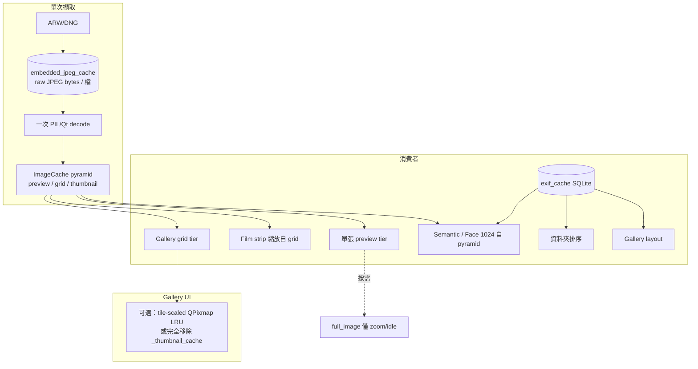
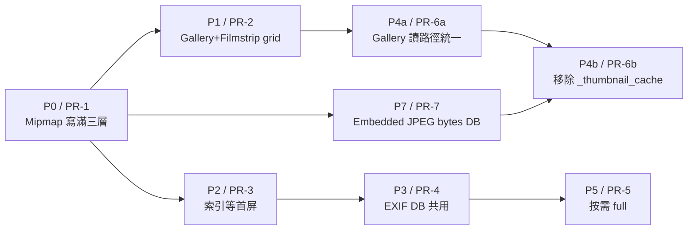

# RAWviewer 縮圖統一與 I/O 去重 — 實作計畫

本文件描述 Gallery、Film strip、單張檢視、語意索引之間的縮圖層級統一、重複 embedded JPEG 解碼消除、以及快取架構收斂的完整實作路線圖。

**相關調查**：[`windows-gallery-performance-investigation.md`](windows-gallery-performance-investigation.md)

**最後更新**：2026-07-02

---

## 1. 背景與問題

### 1.1 現況：多層快取金字塔

全域 `ImageCache`（`src/image_cache.py`）維護多個像素層級：

| 層級 | 典型長邊 | 記憶體 | 磁碟 | 主要消費者 |
|------|----------|--------|------|------------|
| **thumbnail** | ~256px | `thumbnail_cache` LRU | `disk_thumbnail_cache` | Film strip（舊）、索引 fallback |
| **grid** | ~512px (`RAWVIEWER_DISK_PREVIEW_MAX`) | `grid_cache` LRU | `disk_grid_cache` | **Gallery 目標解析度** |
| **preview** | 記憶體 ~1920px (`RAWVIEWER_MEMORY_PREVIEW_MAX`)；磁碟 ~512px | `preview_cache` LRU | `disk_preview_cache` | 單張檢視、`nav_preview` |
| **full_image** | 感應器解析度 | `full_image_cache` | 無 | 單張全解析、`nav_full` |
| **pixmap** | 同上（QPixmap） | `pixmap_cache` | 無 | GPU 顯示 |
| **exif** | — | `exif_memory_cache` | `exif_cache` SQLite | 排序、layout、索引 |

此外，`gallery_view.py` 維護獨立的 **`_thumbnail_cache`**（base + per-tile scaled QPixmap，LRU 10000），與全域 numpy 層重複。

### 1.2 解碼路徑（同一 ARW 可能多次觸發）

1. `extract_embedded_jpeg_by_scan`（TIFF byte-scan，`enhanced_raw_processor.py`）
2. `rawpy.extract_thumb`（LibRaw embedded JPEG）
3. `QImageReader` fallback
4. LibRaw `half_size` postprocess（最重 fallback）

成功解碼後，`UnifiedImageProcessor` 可寫入 structured mipmap（preview / grid / thumbnail），但**並非所有路徑都保證寫滿三層**。

### 1.3 典型痛點（Japan Trip 6881 ARW）

- Orientation purge 後磁碟 pixel tier 清空，冷啟動全量重解。
- 單張 nav prefetch 解出 ~7008px embedded JPEG（preview），Gallery 卻要求 grid ~512px → 尺寸門檻拒絕快取 → 再解一次。
- Semantic metadata 索引與 Gallery 首屏競爭 I/O（`raw_limit=1` throttle）。
- EXIF 排序 probe 與 semantic metadata extract 重複掃檔。
- `nav_full` / prefetch 過早載入感應器解析度 full tier。

---

## 2. 目標架構（終態）



**核心原則**：

1. **一檔一份 embedded JPEG bytes**（磁碟），resize 在記憶體完成。
2. **一次 decode → 寫滿 preview / grid / thumbnail**。
3. **Gallery 與 Film strip 共用 grid tier**。
4. **Semantic 索引等 Gallery 首屏**，優先讀快取。
5. **排序與索引共用 `exif_cache`**。
6. **Full 解析按需**，prefetch 停在 preview。
7. **Gallery 區域快取最終移除**，僅保留 ImageCache + 輕量 tile 縮放快取（若效能需要）。

---

## 3. 階段總覽與 PR 拆分



| PR | 階段 | 內容 | 依賴 | 預估 | 狀態 |
|----|------|------|------|------|------|
| **PR-1** | P0 | 所有解碼路徑寫滿 preview/grid/thumbnail | 無 | 2–3 天 | 已完成 |
| **PR-2** | P1 | 統一 Gallery 與 Film strip 目標層（grid） | PR-1 | 1–2 天 | 待實作 |
| **PR-3** | P2 | Semantic 索引嚴格等 Gallery 首屏 | PR-1 | 2 天 | 待實作 |
| **PR-4** | P3 | 排序與索引共用 EXIF DB | 可與 PR-3 並行 | 2–3 天 | 待實作 |
| **PR-5** | P5 | 按需 full 解析 | PR-1 建議先合 | 1–2 天 | 待實作 |
| **PR-6a** | P4a | Gallery 讀路徑統一（write-through 至 ImageCache） | PR-1, PR-2 | 1–2 天 | 待實作 |
| **PR-6b** | P4b | **完全移除 `gallery_view._thumbnail_cache`** | PR-6a, PR-7 建議先合 | 2–3 天 | 待實作 |
| **PR-7** | P7 | **Embedded JPEG raw bytes 磁碟快取** | PR-1～PR-3 穩定 | 3–5 天 | 待實作 |

**建議合併順序**：PR-1 →（PR-2 ∥ PR-3）→ PR-4 → PR-5 → PR-7 → PR-6a → PR-6b

---

## 4. P0 / PR-1 — 所有 thumbnail 解碼路徑寫滿 preview / grid / thumbnail 三層

### 4.1 目標

任一成功 embedded JPEG 擷取後，全域 `ImageCache` 同時具備三層，供 Gallery / Film strip / Semantic 共用。

### 4.2 主要檔案

- `src/unified_image_processor.py`
- `src/image_load_manager.py`
- `src/enhanced_raw_processor.py`
- `src/semantic_search.py`（`_load_index_source_image`、`_maybe_persist_index_thumbnail`）
- `src/rawviewer_app/workers.py`（若仍使用）

### 4.3 步驟

1. **集中寫入點** — 新增 `publish_mipmap_tiers(file_path, native_array, *, exif_data=None, source="decode") -> str`：
   - 內部使用現有 structured resize（`put_preview` / `put_grid` / `put_thumbnail`）。
   - 回傳已滿足的最高 tier 名稱。
   - `cache_index_source_mipmap_tiers()` 改為薄包裝，避免兩套邏輯。

2. **強制所有出口呼叫**：

   | 路徑 | 動作 |
   |------|------|
   | ILM worker thumbnail 完成 | `_cache_gallery_thumbnail_for_indexing` 擴展為所有 `gallery_thumbnail` 與單張路徑 |
   | 單張 `_cache_display_tier_result` | 改為寫滿三層，不只 `put_preview` |
   | `ThumbnailExtractor` 回傳前 | 由上層統一 `publish_mipmap_tiers` |
   | Semantic 解碼成功 | 呼叫同一入口 |

3. **Skip 策略改為 backfill**：
   - 現況：`cache_index_source_mipmap_tiers` 在任一 tier 存在時整段跳過。
   - 改為：缺哪層從最高現有 tier 降採樣補齊；僅在三層齊全且 orientation 版本正確時 skip。

4. **可觀測性**：
   - `RAWVIEWER_MIPMAP_PUBLISH_DEBUG=1` 記錄每檔寫入 tier。
   - `get_cache_stats()` 增加 `mipmap_publish_count` / `tier_backfill_count`（debug 用）。

### 4.4 驗收

- 冷啟動單張瀏覽一張 ARW 後，`get_grid` / `get_thumbnail` 立即可用。
- 同一檔案 session 內不應連續多次 `[TIFF_PARSE]`（除非 cache purge）。

---

## 5. P1 / PR-2 — 統一 Gallery 與 Film strip 目標層

### 5.1 目標

Film strip 與 Gallery 皆以 **grid tier（~512px）** 為權威來源；thumbnail tier 僅作 fallback。

### 5.2 主要檔案

- `src/main.py`（`_on_filmstrip_thumbnails_needed`、`_prefetch_filmstrip_thumbnails`）
- `src/image_load_manager.py`（`_gallery_memory_thumb_acceptable`、worker tier 選擇）
- `src/rawviewer_ui/gallery_view.py`（`load_visible_images` 門檻）

### 5.3 步驟

1. Film strip 讀取：`get_grid(path) or get_thumbnail(path)`，UI 縮放至 cell。
2. Film strip ILM 請求：解碼目標改為 grid（`gallery_thumbnail=True` 語意或新增 `stages={"grid"}`）。
3. Gallery `thumb_missing` 與首屏 `min_factor` 統一使用 `_gallery_grid_min_dim()`。

### 5.4 驗收

- 單張預取後切 Gallery，可見 tile <500ms 有圖。
- 同檔 log 長邊一致（~512），無 256 vs 512 混用。

---

## 6. P2 / PR-3 — Semantic 索引嚴格等 Gallery 首屏

### 6.1 目標

Gallery 模式下，語意 / metadata 索引不得與首屏搶 I/O；優先消費 `ImageCache` 已有 tier。

### 6.2 主要檔案

- `src/main.py`（`_should_defer_metadata_index_for_gallery`、`_gallery_has_thumbnail_load_pressure`、`_start_semantic_index_build_background`）
- `src/semantic_search.py`（`build_index`）

### 6.3 步驟

1. **統一閘門** `_gallery_blocks_background_indexing()`：
   - `view_mode == "gallery"` 且 `not _first_thumb_ready_after_set`
   - `_gallery_has_thumbnail_load_pressure()`
   - （可選）可見區仍有 `thumb_missing`

2. **所有索引入口** 呼叫統一閘門：`_try_start_metadata_index_worker`、`_retry_deferred_metadata_index_worker`、`_start_semantic_index_build_background`。

3. **兩階段索引**：
   - **Phase A**：`pixels_from_cache_only=True`，只處理 `_index_source_thumbnail_present` 為真的檔案。
   - **Phase B**：首屏後 / idle，處理 pending pixel warm；此時才 `_begin_indexing_load_throttle()`。

4. **環境變數**：
   - `RAWVIEWER_GALLERY_INDEX_FORCE_AFTER_MS`（絕對上限，預設 60s）
   - `RAWVIEWER_GALLERY_INDEX_CACHE_ONLY=1` 強制 Phase A

### 6.4 驗收

- 進 Gallery 後 5s 內不出現 `Starting parallel metadata extraction for 6881`（除非已首屏 paint）。
- `Semantic indexing throttle ON` 時間晚於第一次 `[ORIENT] paint`。

---

## 7. P3 / PR-4 — 排序與索引共用 EXIF DB

### 7.1 目標

資料夾排序、Gallery layout、Semantic metadata 共用 `exif_cache`，避免 6881 檔重複 metadata probe。

### 7.2 主要檔案

- `src/main.py`（`_probe_capture_timestamps_parallel`）
- `src/image_cache.py`（`get_capture_times_for_sort`、`get_multiple_exif`）
- `src/semantic_search.py`（`build_index` metadata 階段）

### 7.3 步驟

1. 排序：先 bulk `get_capture_times_for_sort`，僅 miss 才 `probe_capture_timestamp_from_file`；probe 結果 `put_exif`（minimal row）。
2. Semantic metadata：優先 `get_exif` / `get_multiple_exif`；新增 `_index_exif_present` 快取存在檢查。
3. 統一 minimal EXIF schema：`capture_time`、`orientation`、`original_width/height`。
4. `RAW_EXIF_SENSOR_META_VER` bump 時 invalidate 對應 semantic / exif 列。

### 7.4 驗收

- 第二次開同一資料夾：sort <200ms，無 `Probing 6880 uncached`。
- Semantic metadata cache hit / skip 比例顯著上升。

---

## 8. P4 / PR-6 — 合併 Gallery 區域快取與 ImageCache

### 8.1 P4a — 讀路徑統一（保留 scaled LRU）

**目標**：`_thumbnail_cache[(path, __base__)]` 不再觸發獨立解碼，改為 ImageCache grid 的 write-through QPixmap 快取。

**主要檔案**：`src/rawviewer_ui/gallery_view.py`

**步驟**：

1. `_global_cache_to_base_pixmap` 為唯一 numpy base 來源。
2. 本地 base miss → `get_grid` → `_store_oriented_base_pixmap` write-through。
3. `warm_thumbnails_from_global_cache` 簡化為觸發 `load_visible_images`。
4. scaled tile 快取 `(path, physical_size)` 暫保留（過渡期）。

**驗收**：同一 path 不應同時持有大份 numpy base + 重複解碼路徑。

### 8.2 P4b / PR-6b — 完全移除 `gallery_view._thumbnail_cache`

**目標**：刪除 `gallery_view._thumbnail_cache` LRU 及相關 `_thumb_base_key` / `_scaled_cache_key` 邏輯，Gallery tile 顯示完全由 ImageCache + 即時 fit 驅動。

**依賴**：

- PR-6a 穩定且通過效能回歸。
- **PR-7 建議已合併**（grid tier 取得成本極低，移除本地 base 才不會造成 UI 執行緒阻塞）。

**主要檔案**：

- `src/rawviewer_ui/gallery_view.py`（大量刪減與重構）
- `src/image_cache.py`（可選：新增輕量 `get_grid_pixmap(path)` 或在 gallery 內 cache `QPixmap` weak ref）

**步驟**：

1. **盤點所有 `_thumbnail_cache` 使用點**（約 25+ 處）：
   - `load_visible_images`：改為 `get_grid` → `_fit_tile_pixmap` 直接繪製，可選 memoize `(path, bucket_rect)` → QPixmap。
   - `on_thumbnail_ready` / `_apply_thumbnail_ready_impl`：寫入 ImageCache（`put_grid`），不寫本地 LRU。
   - `_layout_aspect_for_path`、`_reconcile_tile_aspect`：改讀 `get_grid` 或 EXIF，不依賴本地 base。
   - `warm_thumbnails_from_global_cache`：移除或改為 no-op。

2. **Tile 縮放 memo（強烈建議）**：
   - 由於 numpy → QImage → QPixmap 必須在主執行緒進行，完全無 memo 可能導致快速捲動時重複 scale 造成卡頓。
   - 應保留**僅 scaled QPixmap** 的小型 UI 專屬 LRU（不含 base array），key=`(path, tile_bucket)`，容量約 ~200-500。
   - 與「完全移除 `_thumbnail_cache`」目標一致：移除的是 **10000 個 base 層的重複 numpy array**，scaled 輕量快取仍必要以確保 60fps 捲動順暢。

3. **刪除成員**：
   - `self._thumbnail_cache = LRUCache(10000)`
   - `self._thumb_base_key`
   - `_invalidate_scaled_thumbnails_for_path` 等輔助函式（改為 invalidate ImageCache tier 或 orientation rebuild 觸發）。

4. **效能驗證門檻（合併前必過）**：
   - Gallery 快速捲動 6881 張：主執行緒 frame time p95 不劣於 PR-6a 基線 >10%。
   - 記憶體：RSS 應**下降**（移除 10000 slot QPixmap LRU）。
   - Orientation rebuild：無 regression（`RAWVIEWER_ORIENT_DEBUG=1`）。

**風險與緩解**：

| 風險 | 緩解 |
|------|------|
| UI 執行緒重複 PIL/QPixmap scale | 保留 ~500 個 scaled QPixmap 的 UI 專屬 LRU |
| 快速捲動 I/O 擁塞 | 將 `get_grid` miss 時的請求透過 batch worker 批次抓取，避免產生 50+ 執行緒競爭磁碟 I/O |
| Orientation flip 後 stale tile | 繼續使用 `_handle_metadata_rebuild` partial path |

**驗收**：

- `gallery_view.py` 內無 `_thumbnail_cache` 符號。
- Gallery 首屏與捲動效能不低於 PR-6a；記憶體持平或下降。

---

## 9. P5 / PR-5 — 按需 full 解析

### 9.1 目標

Prefetch / 箭頭導航預設停在 preview（~1920px）；感應器解析度 full 僅在 zoom / idle / 使用者明確需要時載入。

### 9.2 主要檔案

- `src/main.py`（`_maybe_queue_background_full_decode`、`_schedule_idle_full_decode_after_nav_preview`、`_start_preloading`）
- `src/image_load_manager.py`（full stage 調度）

### 9.3 策略表

| 情境 | 行為 |
|------|------|
| 箭頭導航 | 僅 `nav_preview` |
| 停留 > T ms 且 fit | 排程 `stages={"full"}` |
| 雙擊 100% zoom | 立即 full |
| Gallery → 單張 | preview 進場，full 背景升級 |
| BACKGROUND prefetch | 禁止 `full` |

**環境變數**：`RAWVIEWER_FULL_DECODE_IDLE_MS`（預設 800）

### 9.4 驗收

- 快速連按箭頭：無大量 `Full-resolution pixels loaded (7008×4672)`。
- 100% zoom 仍能在 preview 已暖時快速升級 full。

---

## 10. P7 / PR-7 — Embedded JPEG raw bytes 磁碟快取

### 10.1 目標

每個 RAW 檔在磁碟保存**一份**從 ARW 擷取出的最大 embedded JPEG 原始位元組。後續 Gallery / 單張 / Semantic / Film strip 皆：

1. 讀取 bytes（無需再開 rawpy / byte-scan 整檔）
2. 一次 decode 為 RGB
3. resize 到 preview / grid / thumbnail 寫入 `ImageCache` pyramid

這是**效益最大**的 I/O 去重手段，從根本上消除對同一 ARW 的重複 `[TIFF_PARSE]` / `extract_thumb`。

### 10.2 依賴

- **PR-1～PR-3 穩定後**再實作，避免與 mipmap / 索引閘門邏輯同時變更難以除錯。
- PR-6b（移除 `_thumbnail_cache`）**建議在 PR-7 之後**，以確保 grid 取得足夠快。

### 10.3 主要檔案

- `src/image_cache.py`（新 `PersistentEmbeddedJpegCache` 或擴展現有 disk cache）
- `src/enhanced_raw_processor.py`（擷取後寫 bytes；讀取短路）
- `src/unified_image_processor.py`（decode 入口改為 bytes-first）
- `src/common_image_loader.py`（orientation version、path key）
- 新 migration / marker 檔（與 `orient_pixel_ver.txt` 類似）

### 10.4 資料模型

**方案 A（推薦）：獨立 SQLite + 檔案系統 blob**

表：`embedded_jpeg_cache`

| 欄位 | 說明 |
|------|------|
| `file_path` | normalized path key（與 exif_cache 一致） |
| `file_size` | 原始 ARW size（失效檢測） |
| `file_mtime` | 原始 ARW mtime |
| `jpeg_width` / `jpeg_height` | 解碼前已知尺寸（可選，來自 SOF） |
| `orientation` | EXIF orientation（擷取時） |
| `sensor_meta_ver` | 對齊 `RAW_EXIF_SENSOR_META_VER` |
| `cache_file` | 相對路徑，如 `embedded/ab/cd/<hash>.jpg` |
| `cached_time` | unix ts |
| `source` | `bytescan` / `libraw` / `native` / `failed` (負向快取：標記無法擷取的損壞檔) |

**失效條件**：

- ARW `size` / `mtime` 變更
- **注意：`sensor_meta_ver` / orientation version bump 時，絕對不要清空此快取！** 擷取出的原始 JPEG bytes 與旋轉邏輯無關。保留 bytes 可讓 orientation 更新後的重建過程直接跳過昂貴的 TIFF/LibRaw 解析。

**方案 B（簡化）：僅檔案系統 + sidecar json**

每 ARW 同目錄或 central cache 下 `<path_hash>.ejpg` + `.meta.json`。較易除錯但 bulk 管理較弱。長期仍建議方案 A。

### 10.5 API 設計

```python
# image_cache.py
class EmbeddedJpegBytesCache:
    def get_bytes(self, file_path: str) -> Optional[bytes]: ...
    def put_bytes(self, file_path: str, jpeg_bytes: bytes, *, meta: EmbeddedJpegMeta) -> None: ...
    def invalidate(self, file_path: str) -> None: ...
    def clear_all(self) -> None: ...

def decode_pyramid_from_embedded_bytes(
    file_path: str, jpeg_bytes: bytes, *, exif_data: Optional[dict] = None
) -> None:
    """Decode once, publish_mipmap_tiers + optional put_bytes already done."""
```

**讀取短路**（`ThumbnailExtractor.extract_thumbnail_from_raw`）：

```
1. bytes = embedded_jpeg_cache.get_bytes(path)
2. if bytes: decode → resize to requested max_size → return
3. else: existing bytescan / libraw path
4. on success: embedded_jpeg_cache.put_bytes(path, raw_jpeg_bytes_from_extract)
5. publish_mipmap_tiers(...)
```

注意：存的是**原始 embedded JPEG bytes**（擷取時未 resize），不是 resize 後的 numpy。Resize 仍發生在 `publish_mipmap_tiers`。

**寫入安全性**：為避免程式崩潰導致快取檔案損壞，寫入 disk blob 時應先寫入 `.tmp` 暫存檔，再使用 `os.replace` 或 `shutil.move` 進行 atomic rename。

### 10.6 擷取 raw bytes 的來源

| 來源 | 如何取得 bytes |
|------|----------------|
| byte-scan | 已有 SOI～EOI 區段，直接 slice |
| LibRaw `extract_thumb` | `thumb.data` / `thumb.jpeg` 若可用 |
| native preview | TIFF strip 原始 JPEG segment |

需統一 `_extract_embedded_jpeg_bytes(file_path) -> Optional[bytes]`，與現有 `extract_embedded_jpeg_by_scan` 並行，scan 成功時同時返回 `(array, raw_bytes)` 或僅 cache bytes 後 decode。

### 10.7 Migration

1. 新增 `embedded_jpeg_ver.txt` marker（預設 `1`）。
2. （移除原本與 orientation bump 連動清除的邏輯，詳見失效條件）。
3. 首次升級：不阻塞啟動；懶寫入（讀取 miss 時照常 extract 並 populate）。
4. 可選：背景 `BACKGROUND` 任務對當前資料夾 batch populate（低優先順序，遵守 PR-3 閘門）。

### 10.8 環境變數

| 變數 | 預設 | 說明 |
|------|------|------|
| `RAWVIEWER_EMBEDDED_JPEG_CACHE` | `1` | 啟用 bytes 磁碟快取 |
| `RAWVIEWER_EMBEDDED_JPEG_MAX_MB` | `2048` | 單檔 bytes 上限（過大 native JPEG 可拒絕或只存 metadata） |
| `RAWVIEWER_EMBEDDED_JPEG_CACHE_DIR` | 沿用 `~/.rawviewer_cache` | blob 根目錄 |

### 10.9 驗收

- 冷啟動第二遍瀏覽同一資料夾：同一 ARW **零次** `[TIFF_PARSE]` / `extract_thumb`（log 計數）。
- 磁碟占用：約 1–3 MB/檔 × N（視 embedded JPEG 大小）；6881 張需監控總量，必要時 LRU eviction。
- Gallery 首屏時間較 PR-1 再降（目標：較現況再快 50%+ on warm bytes cache）。
- Orientation v10 bump 後，`ImageCache` 被 purge，但 `embedded_jpeg_cache` 應不受影響，且重建縮圖時應大量命中 bytes cache（零次 TIFF_PARSE）。

### 10.10 風險

| 風險 | 緩解 |
|------|------|
| 磁碟空間與同步清理卡頓 | 實作 High-Water Mark（如 90%）。觸發時啟動**背景低優先順序**任務清理最舊 20%（LRU），避免同步阻塞主執行緒 |
| 錯誤 bytes 導致 sideways | 存儲時記錄 `sensor_meta_ver`；讀取時 `finalize_index_thumbnail_array` |
| 損壞檔案重複擷取 | 寫入 `source = 'failed'` 進行負向快取 |
| LibRaw 與 byte-scan 擷取不同 JPEG | 優先較大 dimension；版本化 cache key |

---

## 11. 跨平台與極大規模（5000+ 張）優勢分析

本快取統整架構不僅解決了 Windows 上的 I/O 瓶頸，對於 macOS 以及極大數量資料夾（如 >5000 張 ARW）同樣具備決定性的優勢：

### 11.1 macOS 平台效益
- **跨平台 CPU 與電池節省**：無論是 Windows 還是 macOS（Apple Silicon / Intel），省去 LibRaw 或 TIFF byte-scan 的重複解析，都能大幅降低 CPU 負載。這在 MacBook 上會直接體現為顯著的電池續航提升與風扇降噪。
- **APFS 檔案系統相容性**：macOS 的 APFS 處理大量小檔案的能力優於 NTFS，因此 Scheme A 的 Blob 寫入將極為順暢。此外，利用 `os.replace` 的 Atomic Rename 在 POSIX 系統上運作完美，確保快取檔案絕不損壞。
- **減輕記憶體 Swap 壓力**：macOS 積極依賴 Memory Compression 與 Swap。移除 10000 個 `QPixmap` 陣列（PR-6b）能讓 RAWviewer 的記憶體足跡大幅縮小，防止 macOS 將 APP 移入 Swap 導致的卡頓。

### 11.2 極大規模（5000+ 張）資料夾生存指南
本計畫（特別針對 6881 張 ARW 的情境）是 RAWviewer 能在超大資料夾中「存活」的關鍵：
- **OOM (Out of Memory) 防護**：將全域與區域快取收斂至 ImageCache + ~500 個 QPixmap LRU，確保記憶體用量呈現「平坦化」。無論資料夾是 500 張還是 50000 張，記憶體消耗皆固定。
- **背景 High-Water Mark 淘汰**：5000 張 RAW 提取的 JPEG bytes 輕易超過 5GB。非同步的 High-Water Mark（90%）清理機制，確保使用者在瀏覽第 4000 張圖片時，系統不會因為同步刪除舊快取而發生 UI 凍結。
- **SQLite 批次查詢**：讀取 5000 張圖片的 EXIF 排序時間，從逐檔 I/O（數秒至數分鐘）縮減為一次 SQLite Index Query（約 15 毫秒），讓巨型資料夾的二次開啟瞬間完成。
- **語意索引讓路 (PR-3)**：這是防止 5000 張圖片的背景擷取癱瘓磁碟 I/O 的核心。強制語意索引必須等待 UI 首屏繪製完成，保障了使用者的「第一眼」流暢度。

---

## 12. 自動化測試與驗收計畫（全階段共用）

為確保快取統整架構（PR-1 至 PR-7）的穩定性與效能，測試將分為「底層整合測試 (pytest)」、「UI 端到端測試 (pytest-qt)」以及「Log 數據解析驗證」三個層次。

### 12.1 測試資料集 (Fixtures)

- **`dataset_micro` (10 張)**：用於快速單元測試、Schema 驗證與 Orientation 邏輯。
- **`dataset_corrupt` (5 張)**：包含故意損壞的 ARW、0 byte 檔案，用於測試負向快取（Negative Caching）與錯誤恢復。
- **`dataset_macro` (5000+ 張)**：如 `I:\Photos\Japan Trip` (6881 ARW)，用於測試 SQLite 批次效能、記憶體 OOM 防護與 High-Water Mark 淘汰機制。
- **`dataset_multibrand` (`D:\Development\RAW_Sample`)**：包含各大相機廠牌 (Sony ARW, Canon CR2/CR3, Nikon NEF 等) 的 RAW 檔，確保 `bytescan` 與 `libraw` fallback 在跨廠牌時皆能正確提取 JPEG 與方向資訊而不崩潰。

### 12.2 核心自動化測試場景

#### Scenario A:「Decode Once」保證 (PR-1 & PR-7)
- **前置**：清除所有快取（`clear_cache.bat`）。
- **冷啟動**：載入 `dataset_micro` 並等待 idle。驗證 Log `[TIFF_PARSE]` 次數為 10 次。
- **熱啟動**：重啟應用程式。驗證 Log `[TIFF_PARSE]` 次數為 **0 次**，且磁碟 bytes cache 命中率 100%。

#### Scenario B: UI 優先與 I/O 節流 (PR-3)
- **目標**：確保語意索引不會與首屏搶奪 I/O。
- **測試**：冷啟動載入 `dataset_macro`，解析 Log 時間戳記。
- **斷言**：第一筆 `[INDEX] Starting semantic extraction` 的時間點，必須 **晚於** `[GALLERY] First screen painted`。

#### Scenario C: 極限捲動與 OOM 防護 (PR-6b)
- **目標**：驗證 500 個 QPixmap LRU 能保持 60fps 且記憶體平坦。
- **測試**：熱快取下，透過 `pytest-qt` 模擬跳至第 2000 張，再快速捲動至 4000 張。
- **斷言**：
  1. 作業系統 RSS 記憶體用量在捲動期間保持平坦（波動 < 50MB）。
  2. 主執行緒 `QTimer` 紀錄的 Frame Time，大於 32ms (掉幀) 的次數 < 5 次。

#### Scenario D: Orientation 更新不變性
- **目標**：驗證更新翻轉邏輯時，保留昂貴的原始 bytes。
- **測試**：熱快取下，程式化 mock 觸發 `RAW_EXIF_SENSOR_META_VER` 更新，重新載入資料夾。
- **斷言**：Grid/Preview 像素快取 Miss 率 100%（成功清除舊圖片），但 `[TIFF_PARSE]` 次數為 0（成功直接從 bytes 重建）。

#### Scenario E: High-Water Mark 淘汰機制
- **目標**：驗證背景清理不會阻塞 UI。
- **測試**：Mock `RAWVIEWER_EMBEDDED_JPEG_MAX_MB = 10`。連續載入大於 20MB 的圖庫。
- **斷言**：實體目錄大小不超過 ~11MB，觸發 `[CACHE] Background eviction` Log，且主執行緒無阻塞警告。

#### Scenario F: 損壞檔案負向快取
- **測試**：載入 `dataset_corrupt` 兩次。
- **斷言**：第二次載入時 `[TIFF_PARSE]` 次數為 0，且 SQLite 中對應檔案的 `source` 為 `'failed'`。

#### Scenario G: 跨廠牌相容性 (Multi-Brand Compatibility)
- **測試**：清除快取，載入 `dataset_multibrand` (`D:\Development\RAW_Sample`)。
- **斷言**：100% 檔案成功發布至 `grid_cache`（無破圖），解析執行緒零崩潰（Zero exceptions），且 `embedded_jpeg_cache` 根據廠牌正確紀錄 `bytescan` 或 `libraw`。

### 12.3 CI/CD 效能回歸防線
- 建議在 GitHub Actions / GitLab CI 中將 Scenario A, B, F 排入 Pull Request 檢查。
- 監控 **RSS Memory Peak** 與 **TTFP (Time to First Paint)**，若 PR 導致記憶體成長 >10% 或 TTFP 變慢 >20%，需阻擋合併並人工 review。

---

## 13. 環境變數彙總

| 變數 | 階段 | 說明 |
|------|------|------|
| `RAWVIEWER_MIPMAP_PUBLISH_DEBUG` | P0 | mipmap 寫入 debug log |
| `RAWVIEWER_DISK_PREVIEW_MAX` | 既有 | grid 長邊（預設 512） |
| `RAWVIEWER_MEMORY_PREVIEW_MAX` | 既有 | preview 長邊（預設 1920） |
| `RAWVIEWER_GALLERY_INDEX_FORCE_AFTER_MS` | P2 | Gallery 索引絕對上限 |
| `RAWVIEWER_GALLERY_INDEX_CACHE_ONLY` | P2 | 強制僅快取像素索引 |
| `RAWVIEWER_FULL_DECODE_IDLE_MS` | P5 | 停留多久才升級 full |
| `RAWVIEWER_EMBEDDED_JPEG_CACHE` | P7 | 啟用 bytes 磁碟快取 |
| `RAWVIEWER_EMBEDDED_JPEG_MAX_MB` | P7 | 單檔 bytes 上限 |

---

## 14. 決策記錄（ADR 摘要）

| 決策 | 選擇 | 理由 |
|------|------|------|
| Gallery / Film strip 權威層 | grid ~512px | 與 disk tier 一致，減少重解 |
| Semantic 索引時機 | 首屏後 + cache-only phase | 避免 6881 檔與 Gallery 搶 I/O |
| Gallery 本地快取 | PR-6b 完全移除 | 與 ImageCache 重複；PR-7 保證取得速度 |
| Embedded 存儲內容 | 原始 JPEG bytes，非 resize 後 | 一份 bytes 可派生所有 tier |
| Full 解析 | 按需 | 降低記憶體與解碼壓力 |
| PR-7 與 PR-6b 順序 | PR-7 先於 PR-6b | 移除本地快取前需有低成本 grid 來源 |

---

## 15. 後續維護

- Orientation logic（`RAW_EXIF_SENSOR_META_VER`）變更時，同步更新：
  - `orient_pixel_ver.txt` purge
  - exif_cache invalidation
  - **(注意：絕對不要清除 `embedded_jpeg_cache` 原始 bytes)**
- 文件同步：README / RELEASE_NOTES 在 PR-7、PR-6b 合併時各更新一節。
- 效能基準：建議在 `scripts/` 新增可重現的 log 解析腳本（首屏秒數、TIFF_PARSE 計數）。

---

*本計畫為實作藍圖，不包含程式碼變更；各 PR 合併時應更新本文件對應章節的「狀態」欄位（待實作 / 進行中 / 已完成）。*
